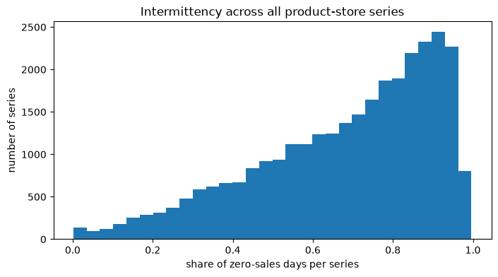
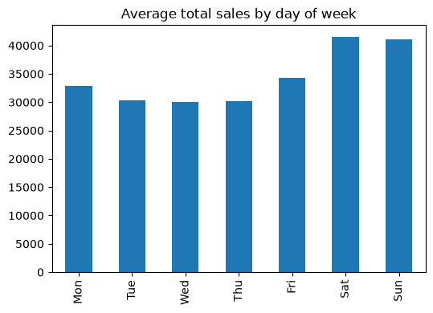
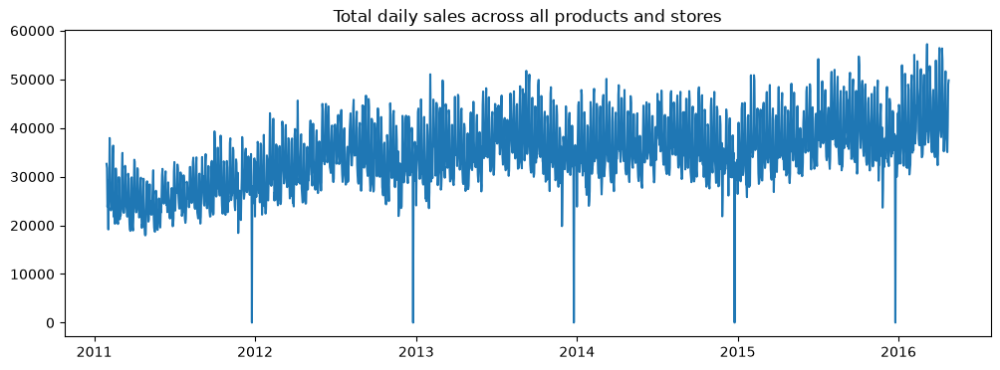
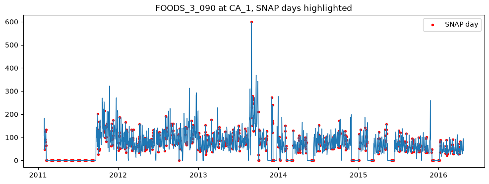
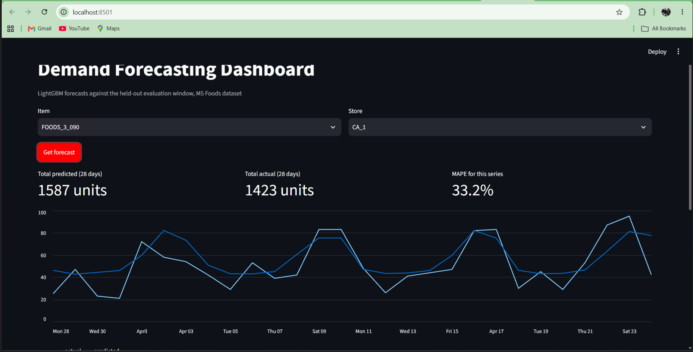
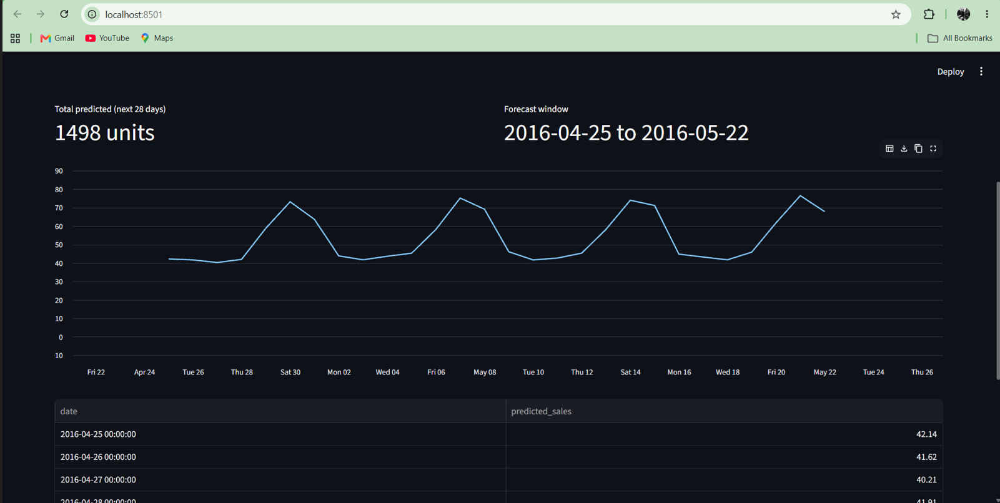
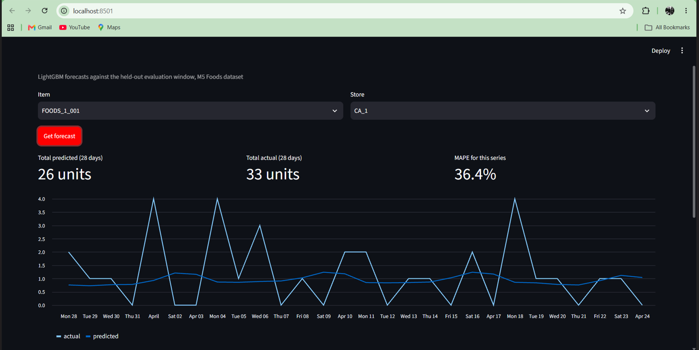

# Demand Forecasting System — M5 Retail Sales (Walmart)

An end-to-end demand forecasting system built on the M5 Forecasting dataset: data pipeline, feature engineering, eight benchmarked forecasting models (classical, gradient boosting, and deep learning), experiment tracking, a served REST API with two honestly-scoped forecast modes, an interactive dashboard, containerization, and CI.

## Table of contents

- [Problem statement](#problem-statement)
- [Dataset](#dataset)
- [Exploratory findings](#exploratory-findings)
- [Architecture](#architecture)
- [Feature engineering](#feature-engineering)
- [Models benchmarked](#models-benchmarked)
- [Results](#results)
- [Model selection](#model-selection)
- [MLOps](#mlops)
- [Serving](#serving)
- [Dashboard](#dashboard)
- [Honest limitations](#honest-limitations)
- [How to run](#how-to-run)
- [Tech stack](#tech-stack)
- [Future work](#future-work)

## Problem statement

Forecast daily unit sales for the Foods category across 10 Walmart stores in California, Texas, and Wisconsin, 28 days ahead, to support inventory planning and reduce stockouts and overstock.

Scope: **Foods category, all 10 stores — 1,437 products × 10 stores = 14,370 individual product-store time series.**

## Dataset

[M5 Forecasting Accuracy](https://www.kaggle.com/competitions/m5-forecasting-accuracy) — real Walmart sales data, 2011-01-29 through 2016-04-24 (1,913 days), released by the University of Nicosia.

| File | Contents |
|---|---|
| `sales_train_validation.csv` | Daily unit sales, wide format, one row per product-store |
| `calendar.csv` | Date mapping, holiday/event flags, SNAP (food assistance) indicators |
| `sell_prices.csv` | Weekly price per product per store |

Full dataset scale: 30,490 series across 3 categories and 3 states. This project scopes to **Foods only**, which carries the richest signal (price + SNAP + high volume) at a computationally reasonable scale for local development.

## Exploratory findings

Four things discovered in EDA directly shaped every downstream design decision in this project.

**1. Heavy intermittency.** Median 73.5% of days have zero sales across all series.



This single number is why LightGBM (Tweedie objective, global model pooling information across series) was chosen as the primary approach over classical per-series methods like ARIMA, and why MAPE reads poorly in aggregate — dividing by small actuals inflates percentage error structurally, independent of model quality.

**2. Clear weekly seasonality.** Weekend sales run meaningfully higher than weekdays.



**3. A genuine upward demand trend**, with sharp, regular drops to zero on Christmas Day (store closures, not a demand signal).



Christmas rows are dropped from training. This trend also explains a drift-check finding described below.

**4. SNAP (food-assistance) days** don't show an obvious single-series visual effect, but are retained as a feature and evaluated statistically rather than by eye.



## Architecture

```
demand-forecasting/
├── data/
│   ├── raw/                 # CSV files
│   ├── interim/             # merged, cleaned, long format
│   └── processed/           # lag/rolling/calendar features
├── models/                  # trained artifacts
├── src/
│   ├── data/                # load, merge, validate
│   ├── features/            # lag, rolling, calendar feature engineering
│   ├── models/               # baselines, LightGBM/XGBoost (recursive), LSTM/N-BEATS/TFT (sequence-based)
│   ├── evaluation/           # metrics (RMSE, MAPE, WRMSSE), walk-forward backtest harness
│   ├── training/              # local entry point, Modal GPU entry point, production/forecast model training
│   └── pipeline/              # single-command orchestration, raw data → evaluated models
├── app/
│   ├── api/                  # FastAPI serving (backtest endpoint + forward-forecast endpoint)
│   └── dashboard/             # Streamlit UI
├── mlops/                    # MLflow tracking config, PSI drift monitoring
├── docker/                   # API and dashboard Dockerfiles + docker-compose
└── .github/                  # CI workflow
```

Data flows in one direction: `data/raw` → `data/interim` (merged, cleaned, long format) → `data/processed` (lag/rolling/calendar features) → `models/` (trained artifacts).

Every model implements the same `BaseModel` interface (`fit`, `predict`, `save`, `load`), so the evaluation harness, MLflow logging, and API serving code are identical regardless of which model is used underneath.

## Feature engineering

- **Lag features**: sales 7, 14, 28 days prior
- **Rolling features**: 7/28-day mean and std, computed on sales shifted by one day to prevent leakage
- **Calendar features**: day of week, month, weekend flag, event flag, SNAP flag (resolved per row by the store's state)
- All lag/rolling computation is grouped per series and respects chronological order strictly — no future information ever leaks backward

Built with **Polars** rather than pandas for this stage specifically: group-wise lag/rolling over 14,370 series benefits heavily from Polars' multi-threaded execution — roughly a 5-10x speedup over the equivalent pandas operations on this data volume.

## Models benchmarked

| Tier | Models | Purpose |
|---|---|---|
| Baseline | Naive, Seasonal-naive | Reference floor — no real model should lose to these |
| Gradient boosting | LightGBM, XGBoost | Global models across all 14,370 series, recursive 28-day forecasting, Tweedie objective (LightGBM) for sparsity |
| Deep learning | LSTM, N-BEATS, TFT | LSTM/N-BEATS hand-rolled in PyTorch (direct multi-horizon output, not recursive); TFT via `pytorch-forecasting`, trained on GPU via [Modal](https://modal.com) |

**Recursive vs. direct forecasting**: LightGBM/XGBoost forecast day-by-day, feeding each prediction back in as the next day's lag input — a standard, well-documented approach that risks compounding error across the horizon. LSTM/N-BEATS predict all 28 days in a single forward pass, sidestepping that risk entirely. Both are legitimate, contrasting design choices, not an inconsistency.

**N-BEATS is deliberately univariate** — it sees only sales history and per-series identity embeddings, no price or calendar features — testing whether its architecture's decomposition can substitute for feature engineering. TFT, by contrast, natively treats price and calendar fields as *known future covariates*, its actual architectural advantage.

## Results

Evaluated via walk-forward validation: last 28 days held out, trained on all preceding history. Primary metric is **WRMSSE** (Weighted Root Mean Squared Scaled Error, the official M5 competition metric) — scaled per-series against a naive one-step-ahead reference, then weighted by each series' recent revenue share. A WRMSSE below 1.0 means the model outperforms a naive forecast; above 1.0 means it underperforms one.

| Model | WRMSSE | Mean RMSE | Mean MAPE |
|---|---|---|---|
| Naive | 1.444 | 2.307 | 90.7% |
| Seasonal-naive | 1.337 | 2.215 | 85.8% |
| **LightGBM** | **0.985** | **1.690** | **56.8%** |
| XGBoost | 1.000 | 1.680 | 61.1% |
| N-BEATS | 1.049 | 1.728 | 61.7% |
| TFT | 1.055 | 1.788 | 76.0% |
| LSTM | 1.078 | 1.739 | 60.8% |

**LightGBM was the only model to clear the WRMSSE 1.0 threshold** — the only one that genuinely outperforms a naive one-step-ahead reference forecast, not just the weakest baselines. This mirrors the real M5 competition result: the winning solutions were LightGBM-based, not deep learning, despite far more complex architectures (TFT specifically) being purpose-built for this class of problem. Reproducing that finding independently, on real data, with a from-scratch pipeline, is itself a result worth stating plainly rather than downplaying.

All 8 runs are logged and comparable in MLflow (params + metrics), not just reported by hand.

## Model selection

**LightGBM is the production model** — best WRMSSE, best MAPE, competitive RMSE, and dramatically cheaper to train than any of the deep learning alternatives (~10 minutes on CPU vs. 1-2 hours on GPU for the others).

## MLOps

- **Experiment tracking**: MLflow, all 8 model runs logged with parameters and metrics in one comparable experiment
- **Pipeline orchestration**: `src/pipeline/run_pipeline.py` — raw CSVs to evaluated, logged models in a single command
- **Drift monitoring**: PSI (Population Stability Index) comparing the held-out window's feature distributions against training. Correctly flags drift on rolling-window features (`sales_roll_mean_7`, `sales_roll_std_28`) — a legitimate finding, not a false positive: the held-out window sits at the highest-demand point in the dataset's genuine upward trend identified in EDA, and rolling aggregates correctly surface that shift while single-day values don't
- **Containerization**: separate Dockerfiles for the API and dashboard, tied together with `docker-compose`
- **CI**: GitHub Actions runs the test suite on every push

## Serving

Two FastAPI endpoints, deliberately scoped differently:

**`GET /forecast?item_id=...&store_id=...`** — forecasts against the held-out historical test window (2016-03-28 to 2016-04-24). Honest backtest: real ground truth exists for this window, so results are directly comparable to actuals.

**`GET /forecast/future?item_id=...&store_id=...`** — genuine forward forecasting into real, uncomputed dates beyond the dataset's range (2016-04-25 onward), using a model retrained on the *full* history. Since future calendar/promotional data doesn't exist, this endpoint makes explicit, disclosed assumptions (no promotions, last known price carried forward) and returns them in the response:

```json
{
  "item_id": "FOODS_3_090",
  "store_id": "CA_1",
  "forecast": [{"date": "2016-04-25", "predicted_sales": 42.14}, "..."],
  "note": "Beyond the dataset's historical range, this forecast assumes no promotional events and a constant price carried forward from the last known value. A real deployment would replace these with the retailer's actual planning calendar."
}
```

Most public M5 portfolio projects only implement the first kind of endpoint. Building both — and being explicit about what separates them — is the difference between "I backtested a model" and "I built something that actually forecasts."

## Dashboard

Streamlit UI with a toggle between the two forecast modes, item/store dropdowns populated from real served data, and per-series metrics.

**Historical mode** — actual vs. predicted overlay, per-series MAPE:



**Forward forecast mode** — genuine future dates, assumptions surfaced directly in the UI:






- **The model tends to smooth toward the average**, under-reacting to genuine volatility — visible as overforecasting on quiet days and underforecasting on the largest spikes. A known characteristic of tree-based recursive forecasters, not unique to this implementation.
- **Recursive forecasting (LightGBM/XGBoost) can compound error across the 28-day horizon**, a known tradeoff of the recursive strategy versus direct multi-horizon output.
- **The future-forecast endpoint assumes no promotions and constant pricing** beyond the dataset's real date range — disclosed explicitly in the API response rather than hidden.
- **TFT and N-BEATS were trained on a reduced history window** (500 → 120 days for TFT specifically, after an initial run revealed the default full-history windowing was computationally impractical) and for fewer epochs than an unconstrained production system would use — a deliberate, disclosed scope tradeoff given portfolio-project compute/time constraints, not a hidden shortcut.

## How to run

**Clone the repo:**
```bash
git clone https://github.com/princ0301/demand-forecasting.git
cd demand-forecasting
```

**Setup:**
```bash
uv sync
```

Place the three M5 CSV files in `data/raw/`.

**Full pipeline** (raw data → evaluated, logged models):
```bash
uv run python -m src.pipeline.run_pipeline
```

**Train and save the production model, then serve it:**
```bash
uv run python -m src.training.train_production_model
uv run python -m src.training.train_forecast_model
uv run uvicorn app.api.main:app --reload
```

**Dashboard** (separate terminal):
```bash
uv run streamlit run app/dashboard/streamlit_app.py
```

**Everything via Docker:**
```bash
docker compose up --build
```

**Drift check:**
```bash
uv run python -m mlops.monitoring.drift_check
```

**MLflow UI:**
```bash
mlflow ui
```

## Tech stack

Python, Polars, Pandas, LightGBM, XGBoost, PyTorch, `pytorch-forecasting`, scikit-learn, MLflow, FastAPI, Streamlit, Docker, GitHub Actions, `uv` (dependency management).
